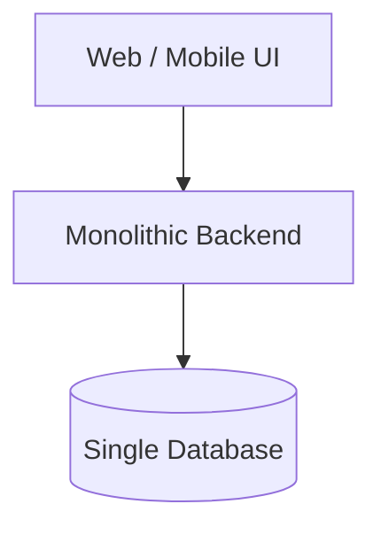
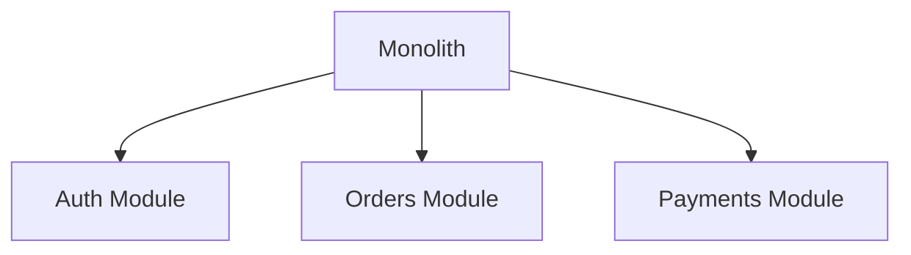
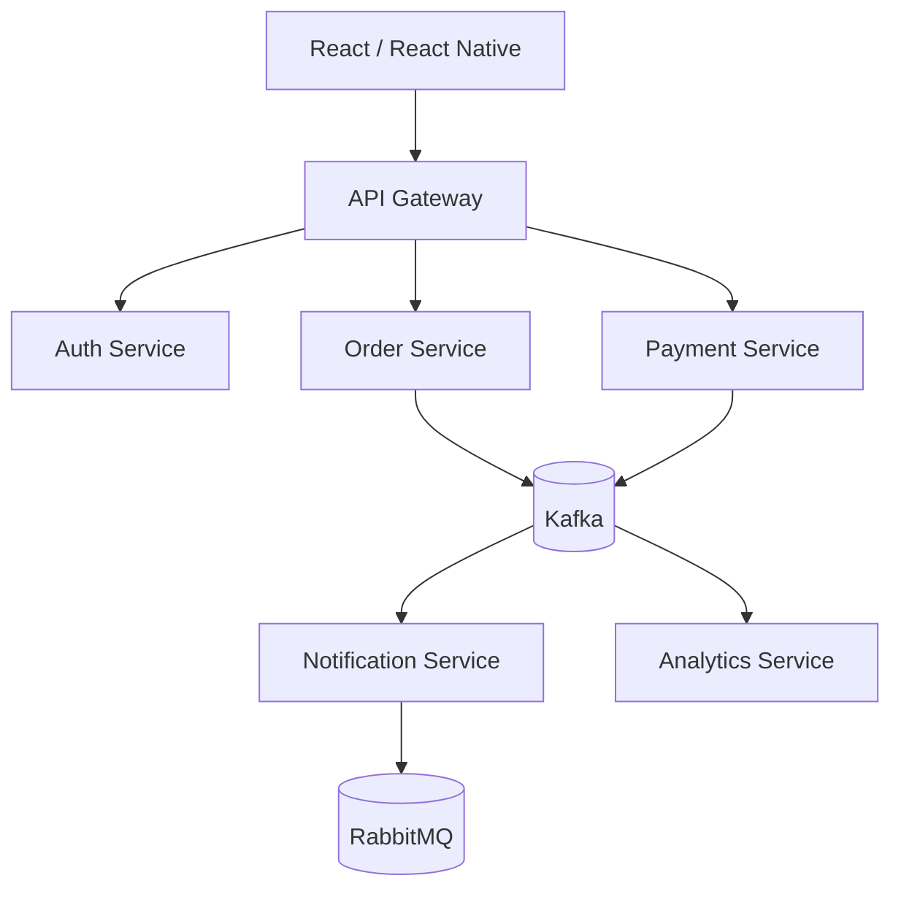
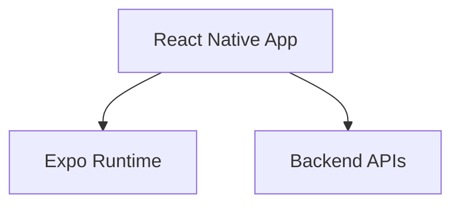
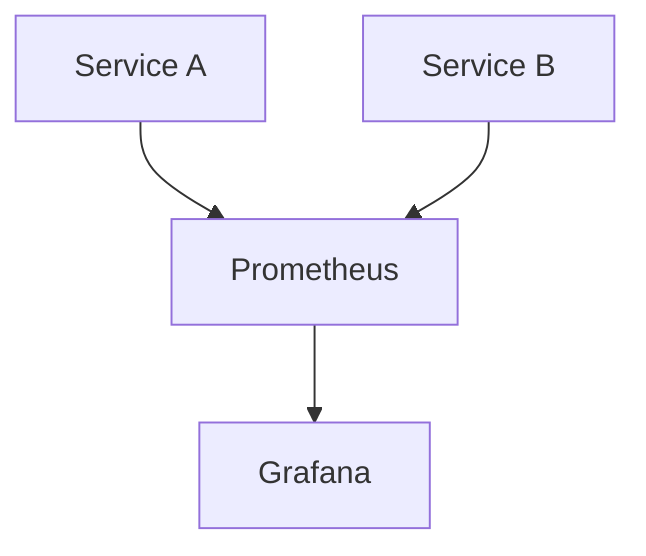
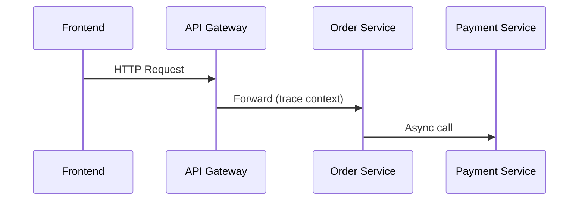
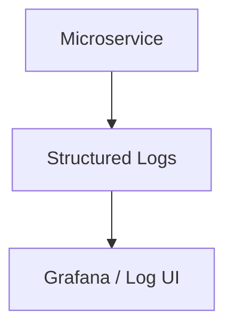

---

# 👋 About Me

I’m a **full-stack engineer** experienced in designing and building **distributed systems**, **event-driven architectures**, and **scalable platforms**.

I’ve worked across the full evolution of systems — from **monolithic applications** to **modular architectures** and **event-driven microservices** — while delivering **web and mobile applications** using React and React Native (Expo).

My focus is on **architecture, reliability, observability, and long-term scalability**.

---

## 🧠 Core Engineering Focus

- System & Software Architecture  
- Distributed Systems & Event Streaming  
- Monolith → Modular → Microservices  
- Scalability, Performance & Reliability  
- DevOps & Platform Engineering  
- Web & Mobile Frontend Development  

---

## 🛠️ Tech Stack

### Cloud Platforms
- AWS (EC2, S3, Lambda, RDS, DynamoDB, ECS, EKS, SQS, SNS)

### Backend & Core Systems
- Go, NestJS, Node.js, TypeScript

### Messaging & Streaming
- Apache Kafka, RabbitMQ

### Frontend & Mobile
- React, React Native, Expo, Next.js

### DevOps & Infrastructure
- Docker, GitHub Actions, Linux

### Databases
- PostgreSQL, MongoDB

---

## 🏛️ Architecture Evolution

### 🧱 Monolithic Architecture

Characteristics

Simple deployment

Fast initial development

Shared database & tight coupling

🔄 Modular Monolith

Characteristics

Clear domain boundaries

Internal module separation

Easier migration to services

🌐 Event-Driven Microservices

Design Choices

Kafka for domain events & streaming

RabbitMQ for background jobs

Independent service scaling

Fault isolation & resilience

📱 Mobile Architecture (React Native + Expo)

Cross-platform iOS & Android

Shared business logic

OTA updates & fast iteration

🔍 Observability & Monitoring

Observability Principles

Observability is treated as a first-class concern across all services.

Metrics → What is happening?

Logs → Why did it happen?

Traces → Where did it happen?

🧰 Observability Stack

Prometheus — metrics & alerting

Grafana — dashboards & visualization

OpenTelemetry — distributed tracing

Structured, correlated logging

📈 Metrics Architecture

Key Metrics

Request latency & error rates

Kafka consumer lag

RabbitMQ queue depth

CPU / memory usage

Business KPIs

🧭 Distributed Tracing

End-to-end request visibility

Context propagation across services

Bottleneck & latency detection

📜 Logging Strategy

JSON structured logs

Trace & request ID correlation

Environment-aware verbosity

🚨 Reliability & Operations

SLO & SLA-driven alerts

Error budget awareness

Low-noise alerting

Proactive incident detection

📊 GitHub Stats

   

🤝 Let’s Connect
GitHub: https://github.com/joshuandeleva

Open to backend, distributed systems & platform engineering discussions
